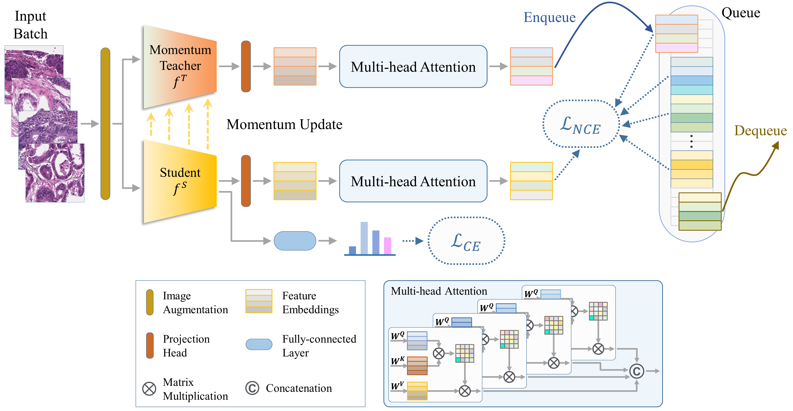

## MoMA

Implementation of paper [[arXiv]](https://arxiv.org/abs/2308.16561): 

"MoMA: Momentum Contrastive Learning with Multi-head Attention-based Knowledge Distillation for Histopathology Image Analysis"
Trinh Thi Le Vuong and Jin Tae Kwak. 

### Release note: The CNN version has been released. We will release the ViT and SwinViT soon.


<p align="center">
  
</p>

Overview of distillation flow across different tasks and datasets. 1) Supervised task is always conducted, 2) Feature distillation is applied if a well-trained teacher model is available, and 3) Vanilla ${L}_{KD}$ is employed if teacher and student models conduct the same task.


<p align="center">
  
</p>

Overview of distillation flow across different tasks and datasets. 1) Supervised task is always conducted, 2) Feature distillation is applied if a well-trained teacher model is available, and 3) Vanilla ${L}_{KD}$ is employed if teacher and student models conduct the same task.

## Train the teacher network (optional) or vanilla students
 
```
./scripts/run_vanilla.sh
```


## Train the moma student network
### If the student and teacher dataset vary in number of categories, you may need to use "--std_strict,  --tec_strict".

```
./scripts/run_moma.sh
```


## Train the student network using other KD methods

```
./scripts/run_comparison.sh
```